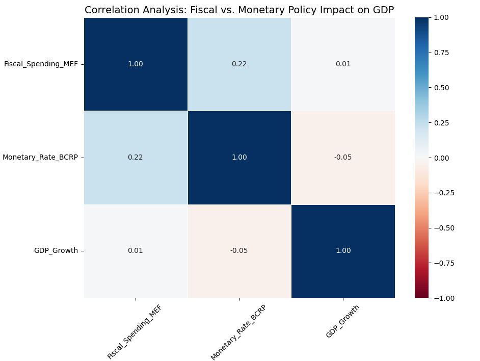

# 🇵🇪 Peru Post-Pandemic: Bridging the Macro-Social Gap
> **A Data-Driven Economic Policy Proposal (2026)**

## 📉 Executive Summary: The "Paradox of Stability"
Peru presents a critical economic contradiction in the post-pandemic era. While the nation maintains exemplary fiscal and monetary discipline—boasting controlled inflation and historic Net International Reserves (RIN)—these fundamentals have failed to translate into social well-being.

**The Reality:**
* **Macro Stability:** High resilience to external shocks.
* **Social Stagnation:** Monetary poverty remains stagnant at ~28.5%, and labor informality exceeds 70%.

This project is not just a data analysis portfolio; it is the computational validation of a **Comprehensive Public Policy Proposal** designed to reactivate potential growth and close the structural disconnect between the BCRP's success and the reality of Peruvian households.

---

## 🏛️ Research & Economic Hypothesis
Based on the **IS-LM-MC theoretical model** (Mundell-Fleming for small open economies) and the "Propuesta Integral de Política Públicas 2026" paper included in this repository.

### The Core Problem
The "Inertial Growth Model" that sustained Peru for decades has been exhausted. Fiscal discipline alone is insufficient to protect vulnerable populations or close productivity gaps in the Andean and Jungle regions.

### 💡 The Hypothesis
> **"Institutional coordination between the Ministry of Economy and Finance (MEF) and the Central Reserve Bank (BCRP) generates a multiplier effect significantly superior to isolated measures."**

Current isolated policies result in a "crowding-out" effect or insufficient aggregate demand stimulus. I propose a **"Mixed Policy" framework**:
1.  **Fiscal Expansion:** +15% execution in hydraulic infrastructure (high multiplier $k=1.4$) & Tax Credits for formalization.
2.  **Monetary Accommodation:** A reference rate reduction (to 5.00%) to ensure liquidity accompanies public spending.
3.  **Result:** A calculated combined multiplier of **$k=1.6$**, maximizing GDP growth without compromising the inflation target.

---

## 📊 Data-Driven Validation
To move from theory to evidence, I engineered a robust data pipeline using historical data (2010-2024) from the **BCRP** and **INEI**.

### 1. Key Insight: Statistical Evidence of the Disconnect
Using Python (Pandas/Seaborn) to calculate the Pearson Correlation Matrix on historical data, we uncovered a crucial finding that validates the need for reform:

**Interpretation:**
* The historical correlation between **Fiscal Spending (MEF)** and **GDP Growth** is negligible (~0.01).
* The correlation with **Monetary Rate (BCRP)** is slightly negative (~-0.05).
* **Conclusion:** Historically, these institutions have operated in silos. The lack of correlation proves that without the proposed **"Policy Synchronization,"** government spending fails to move the needle on GDP effectively.

---

## 🛠️ Technical Implementation
This repository translates economic theory into a functional Data Engineering and Analytics architecture.

### **1. Data Engineering (SQL Server)**
* Built a **Star Schema** Data Warehouse (`PeruMacroEconometrics`).
* **ETL Process:** Cleaned and transformed raw monthly data from BCRP and INEI.
* **Dimensional Modeling:** Created `Fact_Macro_Indicators` (National level) and `Fact_Regional_Development` (Departmental level) to handle the different granularities of inflation vs. poverty.

### **2. Statistical Analysis (Python)**
* **Connection:** Established direct `pyodbc` pipelines between SQL Server and Python.
* **Analysis:** Performed correlation analysis and statistical validation of the macroeconomic variables to test the research hypothesis.

### **3. Business Intelligence (Power BI) - *In Progress***
* Developing a **Geospatial Heatmap** to visualize the "Territorial Inequality," demonstrating how macroeconomic growth is concentrated in the coast while informality is absorbed by the Sierra and Selva regions.

---

## 👨‍💻 About the Author
**Aaron Olmedo López**
*Economist & Data Analyst*

Combining economic theory with advanced data analytics to design evidence-based public policies. Focused on structural reforms, fiscal multipliers, and data engineering.